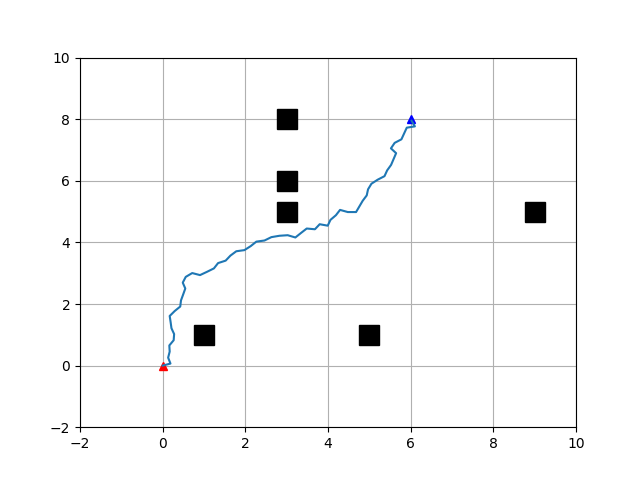

# rrt and `rrt*` application
This repository is an implementation of C++ version of global rapidly exploring random tree and its improved version algorithm

## Environments

- C++ 11
- python 3
- numpy
- matplotlib

## Installation

```
git clone git@github.com:hadleyhzy34/RRT.git
cd RRT
mkdir build
cd build
cmake ..
make
```
## running

```
cd build
./main
```

## visualization

```
python traj_vis.py
```


